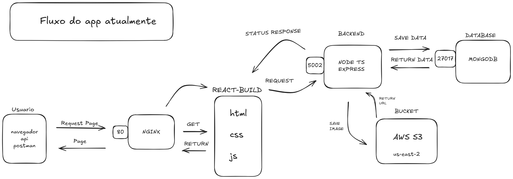

# Fatek - Blog Oficial da Comunidade Fatec

Bem-vindo ao Fatek, o blog dedicado à comunidade da Fatec! Aqui, você encontrará conteúdos voltados para o universo acadêmico, tecnológico e inovador da nossa faculdade. Se você é aluno, professor ou apenas um entusiasta da tecnologia, este blog é o seu lugar!

## Tecnologias Utilizadas

Este blog é um projeto desenvolvido utilizando algumas das tecnologias mais modernas do mercado. Confira abaixo as principais ferramentas que usamos:

- **Node.js**: Ambiente de execução JavaScript no lado do servidor.
- **Express.js**: Framework minimalista para Node.js, usado para construir APIs rápidas e eficientes.
- **React Native**: Framework para desenvolvimento de aplicativos móveis multiplataforma (Android e iOS).
- **MongoDB**: Banco de dados NoSQL, altamente escalável e flexível.
- **Azure**: Plataforma de nuvem da Microsoft, usada para deploy, hospedagem e escalabilidade do projeto.
- **Clean Architecture**: Arquitetura de software focada na separação de responsabilidades e manutenção fácil, visando criar um código mais organizado e testável.
## Arquitetura do app atualmente.
   

## Fluxo na camada mais externa.
   

## Estrutura do Projeto

Este projeto segue o conceito de **Clean Architecture**, onde separamos a aplicação em camadas distintas para manter o código organizado e facilitar a manutenção. As camadas principais são:

- **API (Backend)**: Desenvolvido com Node.js e Express.js. Esta camada é responsável por fornecer dados e funcionalidades para o frontend e o aplicativo móvel.
- **Frontend Web**: Construído com React (ou React Native para a versão mobile). A interface do usuário para a versão web do blog será interativa e moderna.
- **Banco de Dados**: MongoDB será usado para armazenar as informações do blog, como postagens, comentários e usuários.
- **Deploy**: Utilizamos a plataforma Azure para o deploy do backend e frontend, garantindo alta disponibilidade e escalabilidade.

## Como Rodar o Projeto Localmente

### Requisitos

- Docker e Docker Compose instalados no seu sistema.
- Node.js (v14 ou superior).
- MongoDB (em container Docker ou serviço de MongoDB online como MongoDB Atlas).

### Passos para rodar o projeto com Docker Compose

1. **Instale as dependências:**

   `npm install`

2. **Suba os containers do Docker:**

   `docker-compose up -d`

## Contribuições

Este projeto é open-source! Se você deseja contribuir, fique à vontade para enviar pull requests ou abrir issues. Acreditamos na colaboração para tornar o Fatek ainda melhor.
