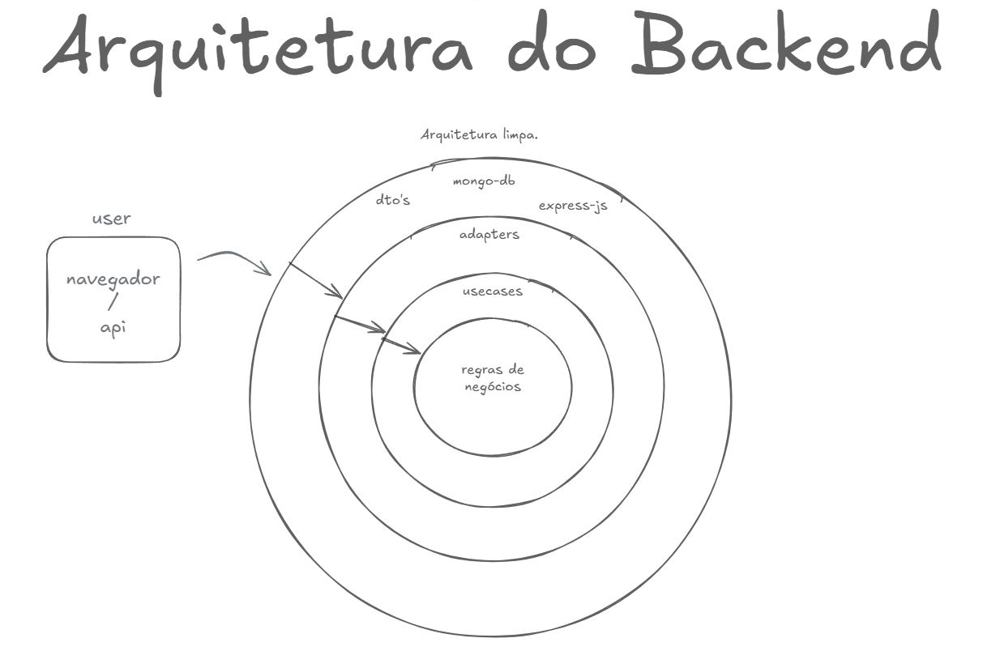
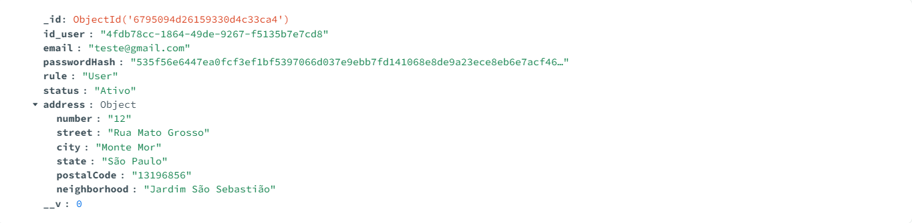
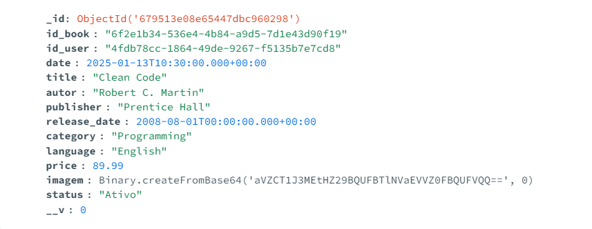

# Fatek - Trade de livros da Fatec

Bem-vindo ao Fatek, o OLX de livros da Fatec! Aqui, você encontrará conteúdos voltados para o universo acadêmico, tecnológico e inovador da nossa faculdade. Se você é aluno, professor ou apenas um entusiasta da tecnologia, este é o seu lugar!

## Tecnologias Utilizadas

Este blog é um projeto desenvolvido utilizando algumas das tecnologias mais modernas do mercado. Confira abaixo as principais ferramentas que usamos:

## ## Componentes Principais
 
  

## Arquitetura do app atualmente.

- **Node.js com Typescript**: Ambiente de execução JavaScript no lado do servidor.
- **Express**: Framework minimalista para Node.js, usado para construir APIs rápidas e eficientes.
- **React**: Biblioteca para desenvolvimento de aplicativos web.
- **AWS S3**: Utilizado para o upload das imagens dos livros.
- **JWT**: Json Web Token para enviar as requisições.
- **MongoDB**: Banco de dados NoSQL, altamente escalável e flexível.
- **NGINX**: Servidor WEB, altamente escalável e flexível.
- **Azure**: Plataforma de nuvem da Microsoft, usada para deploy, hospedagem e escalabilidade do projeto.
- **Clean Architecture**: Arquitetura de software focada na separação de responsabilidades e manutenção fácil, visando criar um código mais organizado e testável.

## Estrutura do Backend (Fluxo entre as Camadas)

   

1. **Navegador (Usuário)**:  
   O usuário interage com a aplicação através do navegador ou aplicativo móvel. As ações realizadas (como cliques e preenchimento de formulários) geram solicitações enviadas para a camada de infraestrutura.

2. **Infraestrutura (Infra)**:  
   A infraestrutura recebe as solicitações enviadas pelo navegador. Aqui, frameworks e drivers (como o Express.js) processam essas solicitações e as encaminham para os adaptadores, traduzindo-as para um formato compreensível pelas regras de negócio.

3. **Adaptadores (Interface)**:  
   Os adaptadores conectam a camada de infraestrutura com os casos de uso. Eles interpretam as entradas recebidas, validam os dados e chamam os casos de uso corretos para atender à solicitação.

4. **Casos de Uso (Use Cases)**:  
   A camada central e mais importante da aplicação, onde estão definidas as regras de negócio. Os casos de uso processam a solicitação, acessam o banco de dados ou executam outras lógicas necessárias, sempre seguindo as regras definidas.

5. **Entrega das Respostas**:  
   Após o processamento, o fluxo segue no sentido inverso:
   - Os casos de uso retornam os dados aos adaptadores.
   - Os adaptadores traduzem os dados em um formato apropriado.
   - A infraestrutura os envia ao navegador, que exibe os resultados para o usuário.

1. **NGINX**:  
   Servidor web usado para servir os arquivos estáticos do frontend (React JS).  
   - Porta: **80**  
   - O NGINX entrega o frontend para o navegador do usuário. Todas as interações com o backend acontecem diretamente entre o React e o Node.js.

2. **Node.js com TypeScript**:  
   Ambiente de execução JavaScript no lado do servidor, responsável por processar as regras de negócio e servir as APIs.  
   - Porta: **5002**  
   - O backend recebe e trata as requisições do frontend (React JS).  

3. **Express.js**:  
   Framework minimalista para Node.js, usado para construir as APIs que o frontend consome.  
   - É a base das rotas e controladores dentro do backend.

4. **React JS**:  
   Framework utilizado para construir a interface do usuário.  
   - O React é servido como arquivos estáticos pelo NGINX e se comunica diretamente com o backend via chamadas de API.  

5. **MongoDB**:  
   Banco de dados NoSQL, usado para armazenar os dados da aplicação.  
   - Porta: **27017**  
   - O backend interage diretamente com o MongoDB para leitura e escrita de dados. 

## Exemplos de algumas coleções: 

   **Usuario**:
   

   **Livro**:
   

   

## Como Rodar o Projeto Localmente

### Requisitos

- Docker e Docker Compose instalados no seu sistema.
- Node.js (v14 ou superior).
- MongoDB (em container Docker ou serviço de MongoDB online como MongoDB Atlas).

### Passos para rodar o projeto com Docker Compose

1. **Instale as dependências:**

   `npm install`

2. **Suba os containers do Docker:**

   `docker-compose up -d`

## Contribuições

Este projeto é open-source! Se você deseja contribuir, fique à vontade para enviar pull requests ou abrir issues. Acreditamos na colaboração para tornar o Fatek ainda melhor.
